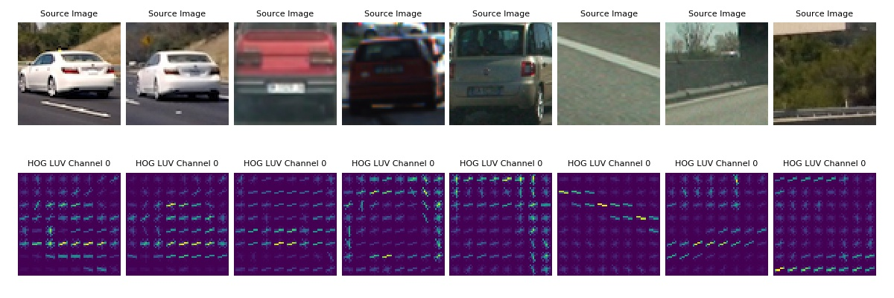
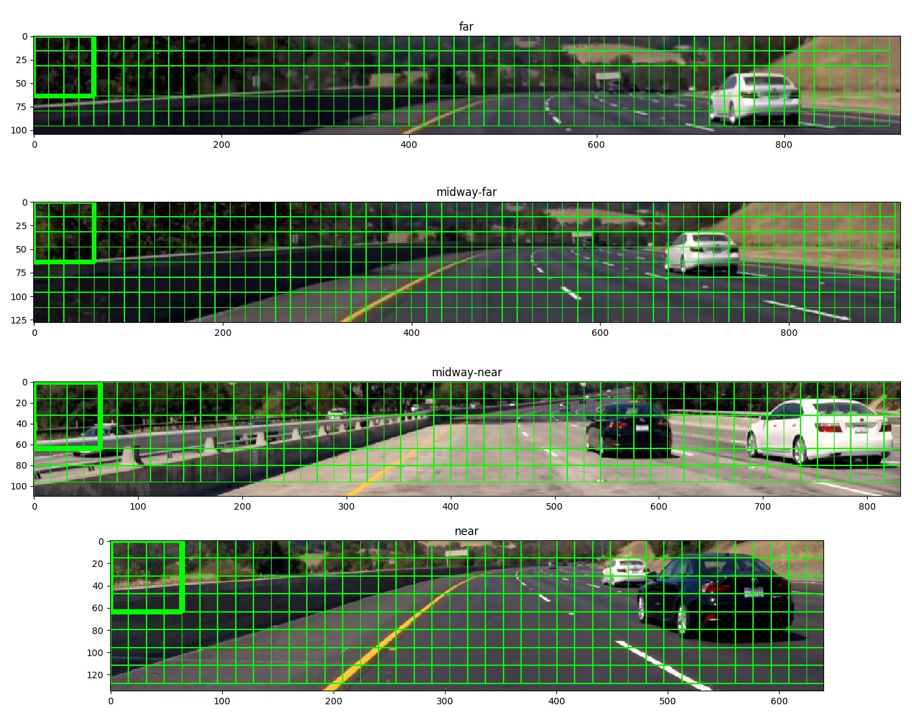
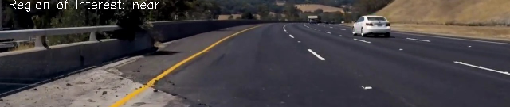
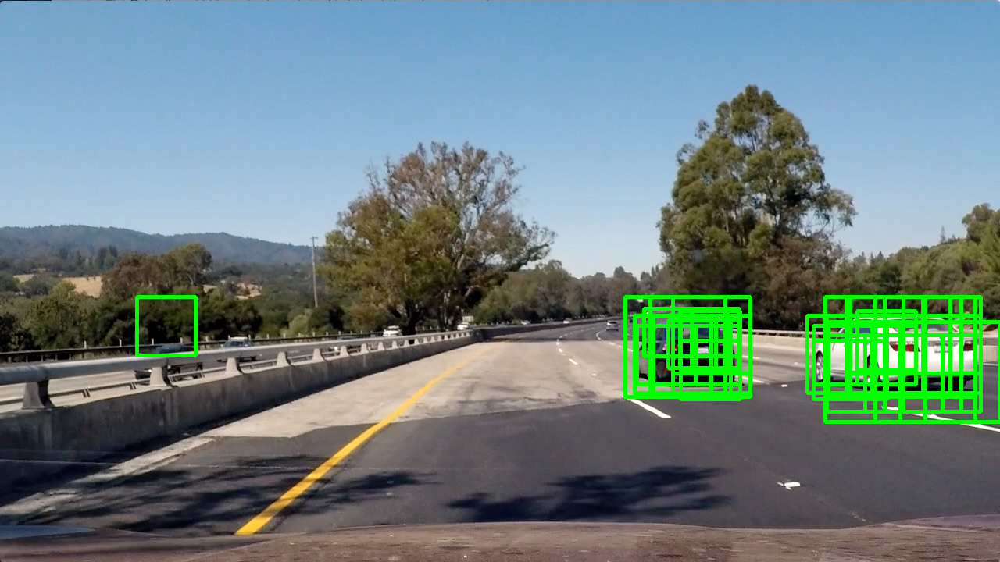

# Vehicle Detection
[](http://www.udacity.com/drive)


Overview - Udacity Self Driving Car Term 1 Project 5
----------------------------------------------------


The goal is to identify cars from a video taken from the dashboard of a car driving on the road. 
Detecting other vehicles is extremely important for self driving cars as it the only way a self driven car can avoid collisions.

The project is divided into the following sections:

* Training Data
* Training a Classifier
* Detecting Cars
* Estimating Bounding Boxes for the Detected Cars
* Reducing Jitter
* Output
* Discussion

 
## Training Data

### Source
Here are links to the labeled data for [vehicles](https://s3.amazonaws.com/udacity-sdc/Vehicle_Tracking/vehicles.zip) 
and [non-vehicles](https://s3.amazonaws.com/udacity-sdc/Vehicle_Tracking/non-vehicles.zip) examples used in the project to the classify cars. 
These example images come from a combination of the [GTI vehicle image database](http://www.gti.ssr.upm.es/data/Vehicle_database.html), 
the [KITTI vision benchmark suite](http://www.cvlibs.net/datasets/kitti/), and examples extracted from the project video itself.
Note that although the data states that these are for vehicles, this data is only for cars.  

The training data must be downloaded and added to the `/data` directory

There are some example images for test in the `/test_images` directory

The test results (at various stages of the pipeline development) are stored in the `/output_images` directory

### Loading the Data

The data is first loaded and we notice that we have a balanced dataset for vehicles and non vehicles 
```
Number of car images:  8792
Number of not-car images:  8968
Size (w x h) of a car image :  (64, 64)
Size (w x h) of a not-car image:  (64, 64)
```
We examine a few images from both sets


## Training a Classifier

We train a classifier to predict if a given 64x64 image is a car or a not-car. The 64x64 size is used as images in our training data are 64x64. 
The goal is to get the classifier to predict as accurately as possible. 
The input feature vector supplied to the classifier for training is iteratively altered to find one that trains to a high (~99%) level of accuracy.
The input to the classifier is normalized as it may contain multiple features of different magnitudes concatenated together.

### HOG Features
 
HOG features are extracted with `9 orientations, 8 pixels per cell and 2 cells per block` for channel 0 in the LUV colorspace.



Using this configuration we can see that a car has a horizontal top and bottom with some vertical orientations on the side. 
At times the read windshield and boot are also identifiable in the hog image.
The non car images are random and more empty.
  
### Feature Vector

In addition to using HOG we also use the spacial and histogram of color features. The feature vector used has a length of 4932.

The first 3072 inputs are from the spacial features. The image array (64x64x3) is flattened into a 1d vector and used as an input.
The next 96 inputs are the histogram of colors. Histograms of each RGB channel is taken into 32 bins thus making 96 inputs. 
The next 1764 inputs are the histogram of gradients (or HOG) as described above.

### Normalization

During the training phase the `StandardScaler` from `sklearn.preprocessing` is used to normalize the feature vectors.

```
# Normalize the feature vectors
scaler = StandardScaler().fit(X)
scaled_X = scaler.transform(X)
```

It is important to note that when detecting cars we need to again use the same normalized vector with the features in the correct order to get the right predictions.

The scaler need not be computed on every time the detection is done. Once the input is set and feature vector finalized the scalar can be saved to disk and reloaded when needed.

```
if classify:
    ...
    joblib.dump(scaler, 'scalar_classifier.pkl')
else:
    scaler = joblib.load('scalar_classifier.pkl')
```

### Classification

The training data is split into two sets, with 20% going into the validation set (X_text, y_test here)

```
# Split data into randomized training and test sets
rand_state = np.random.randint(0, 100)
X_train, X_test, y_train, y_test = train_test_split(scaled_X, y, test_size=0.2, random_state=rand_state)
```

The classifier used is a Support Vector Machine `LinearSVC` from `sklearn.svm`

```
# Use a linear SVC to train a classifier
svc = LinearSVC()
svc.fit(X_train, y_train)
```
 
The output from the classification step looks like
```
Feature vector length: 4932
27.22 Seconds to train SVC...
Test Accuracy of SVC =  0.9866
```

Once the classifier has been trained well, its data is saved to disk and can be reloaded when needed.
```
if classify:
   ...
   joblib.dump(svc, 'svc_classifier.pkl')
else:
    svc = joblib.load('svc_classifier.pkl')
```

Now that we have have a classifier that, given a 64x64 image, can predict if that is a car or not. We examine the view from the dashboard and try to detect the cars on the road.

## Detecting Cars

### Sliding Windows 
The view of the road can be broken down into blocks of 64x64 and we can slide a window through these blocks to locate cars with the classifier we just trained. 

### Scaling to Find Larger or Smaller Cars
We know that cars nearer to point of view will appear large and the cars out near the horizon appear small. 
The input image can be scaled and our sliding window will effectively find inputs similar to our training data (64x64)
We run every input image at four scales.

### Regions of Interest
We know that cars drive on the road and are not to be seen on trees and the in the sky (at least not yet!)
Thus we can define our regions of interest for the four different areas on the road (near, midway-near, midway-far and far)


Each region of interest is scaled so that the car meant to be identified in that region 
(note that cars my appear in multiple regions but they are best identified in a particular one) 
is about the size of the car that was used for training in a 64 x 64 image.
Windows slide across each region identifying cars using the classifier we trained. 


  
Let us take an example of a car that is not near and not far from the point of view and see how it is identified in the various
regions of interest.




The car is detected in the midway ROIs as one would expect, it is not detected in the near and far ROIs.
Our intuition of using different ROIs holds good.
After combining the ROIs we get


Multiple cars are identified well too



The method that collects all the windows where cars are identified from all the ROIs is `get_all_hot_windows`.
`get_all_hot_windows()` calls the `get_hot_windows` method where the detection of cars is done.
`get_hot_windows()` computes the steps for the windows and for each step it extracts the features for the window and then
normalizes the feature vector. This is followed by making a prediction if there is a car in the image or not.

```
def get_hot_windows(woi, roi, svm, scaler):
    w_h = woi['window'][0]
    w_w = woi['window'][1]
    hot_windows = []
    steps_y, steps_x = get_window_steps(img_height=roi.shape[0], window_height=w_h,
                                        img_width=roi.shape[1], window_width=w_w,
                                        pixels_per_step=woi['pixels_per_step'])
    for step_x in steps_x:
        for step_y in steps_y:
            img_to_test = roi[step_y:step_y+w_h, step_x:step_x+w_w]
            features = extract_features_single(img_to_test, color_space=colorspace, orient=orient,
                                               pix_per_cell=pix_per_cell, cell_per_block=cell_per_block,
                                               hist_feat=True, spatial_feat=True, hog_channel=hog_channel)
            test_features = scaler.transform(np.array(features).reshape(1, -1))
            prediction = svm.predict(test_features)
            if prediction == 1:
                hot_windows.append(((step_x, step_y), (step_x+w_w, step_y+w_h)))
    return np.asarray(hot_windows)
``` 

## Estimating Bounding Boxes for the Detected Cars

A Car is found by multiple windows in a single Region of Interest. Additionally, it is also found in multiple Regions of Interest


To group the multiple identifications of a car a heatmap is used. A heat map simply takes an empty image (all zeros) and adds a 1 for every pixel where the car is identified.
This is implemented in the method `add_heat`

```
def add_heat(black, windows):
    # Iterate through list of windows and add heat to each pixel in the window
    for window in windows:
        black[window[0][1]:window[1][1], window[0][0]:window[1][0]] += 1
    return black
```
    
In addition to the cars we also find many False Positives. In order to reduce false positives we follow two approaches. 
We apply a threshold function to the heat map. Cars are identified by multiple windows whereas the false
positive only have a few votes.
  
```
 def apply_heat_threshold(heatmap, threshold):
    # Zero out pixels below the threshold
    heatmap[heatmap <= threshold] = 0
    return heatmap
```

One can see using the threshold a number of false positives are removed


To further reduce the false positives we also maintain a history of centroids of the detected cars. Only if a car centroid appears within 30 pixels in more than 3 out of 5 previous frames is it 
drawn on the image. As false positives appear only for a frame or two in the video this helps reduce false positives considerably. This is implemented in the `draw_bboxes` method. 
A list of scores is maintained for every bbox that is to be drawn 

```
# look back 5 frames
    for centroids_frame in centroids_history:
        for i, bbox in enumerate(bboxes_requested):  # iterate over each bbox that is requested to be drawn
            bbox = np.asarray(bbox)
            bbox_centeroid = centeroid(bbox)
            if len(centroids_frame) > 0:     # only if we have data in the centroids frame should we compute the scores
                distances_to_centroids = np.sqrt(np.sum(np.square(centroids_frame - bbox_centeroid), axis=1))
                if np.min(distances_to_centroids) < 30:  # max 30 pixels away from previous centroid
                    bboxes_scores[i] += 1
```

Only if the the score is greater than 3 we draw the bbox, again from the `draw_bboxes` method
```
if bboxes_scores[i] >= 3:   # only accept bbox if 3+ out of 5 votes from previous frames
    ...
    cv2.rectangle(cp, tuple(bbox[0]), tuple(bbox[1]), (0, 1, 0), thickness=3)
```                
                    

## Reducing Jitter of the Bounding Box

In order to reduce the jitter the bounding boxes around the cars the bounding boxes from the previous frame are maintained. 
While drawing the bounding box on the current frame, the same box from the previous frame is found (in `find_previous_bbox` and a low pass filter applied. 
This is done by the `low_pass_filter` method.

```
def low_pass_filter(bbox, prev_bbox, alpha=0.6):
    return (bbox*alpha + (1-alpha)*prev_bbox).astype(np.int)
```    
 
## Output
 
The final video with the cars annotated can be [found here](processed_project_video,mp6) 

## Discussion

- We could extract the HOG features for the whole source image at once do and then slide windows over it to improve efficiency.
- Significant improvements in identifying vehicles can be made if we know that the road is curving right or left. 
The region of interest can modified based on the curvature of the road. This would lead to reduced sizes of ROIs and 
it would handle the identification of cars across the divider. 
This solution already provides support for x axis cropping in the ROIs
- This solution does not suffer from false positives but these can be further reduced by increasing the number of frames 
where the centroid history is stored. We are using 5 (with 3+ votes) here, using 10 (with 6+ votes) should solve this problem 
as false positives show up for only a few frames
- Once the centroid on a car is found we could get a much better bound on the car by finding its color and then looking for a 
bounding box with that color and saturation (cars tend to have high saturation as they are painted)
- This method may not work realtime input as it handles about 1 frame per second. We would need to optimize the performance to get at least
16 frames / sec to be able to handle realtime data.
- It would be interesting to compare a deep learning approach with this approach. The deep learning approach may take longer to 
train but should be considerably faster on detecting images,
